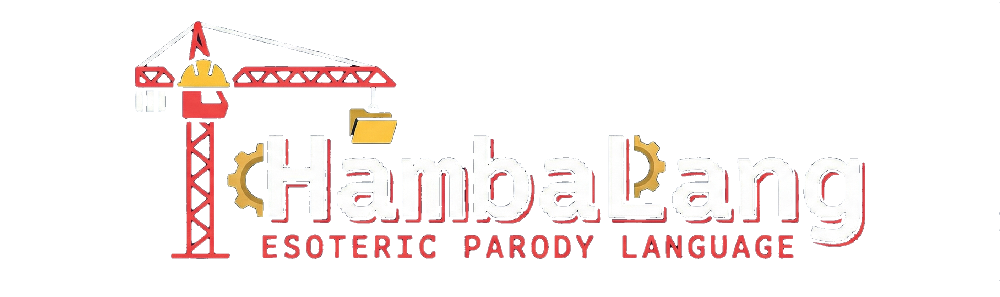

# 🏛️ HambaLang v5.0 - The Academic Era




> "Bahasa pemrograman satir pertama yang memiliki spesifikasi formal, VM deterministik, dan paper akademik."

HambaLang bukan lagi sekadar lelucon. Ini adalah **studi kasus komputasi birokrasi** yang diimplementasikan dengan rigor matematis.

---

## 📚 Formal Documentation (Phase 5)

Kami telah melegitimasi HambaLang sebagai entitas akademik yang serius.

### 📜 Specifications
- **[Language Specification](docs/HambaLang_Spec.md)**: Definisi formal filosofi, memory model, dan type system.
- **[Formal Grammar (EBNF)](docs/Grammar.ebnf)**: Notasi bebas konteks untuk parser generator.
- **[Operational Semantics](docs/Semantics.md)**: Definisi matematis (Small-step SOS) untuk transisi state `Korupsi`, `Anggaran`, dll.
- **[VM Specification](docs/VM_Spec.md)**: Arsitektur stack machine, opcode table, dan format binary `.hbc`.

### 🎓 Academic Paper
- **[HambaLang: A Satirical Bytecode-Compiled Language](paper/HambaLang.md)**: Paper gaya Sigbovik untuk publikasi jurnal.

---

## 🏗️ Architecture Evolution

1.  **Phase 1**: Interpreter Sederhana (Meme)
2.  **Phase 2**: AST & Structured Programming
3.  **Phase 3**: Bytecode Compiler & Virtual Machine
4.  **Phase 4**: Obfuscation & Security (Hell Mode)
5.  **Phase 5**: **Formal Verification & Academic Theory** (Current)

---

## 🔒 Security & Verification

HambaLang v5.0 menjamin:
- **Determinism**: Eksekusi program identik untuk seed yang sama.
- **Bounded Execution**: Loop infinite dicegah melalui mekanisme `Anggaran/Budget`.
- **Anti-Analysis**: Obfuscated VM mencegah reverse engineering casual.

---

## 🚀 Quick Start (Academic Mode)

### Mempelajari Semantik
```bash
# Lihat definisi formal statement 'Korupsi'
cat docs/Semantics.md
```

### Membaca Spesifikasi VM
```bash
# Pelajari arsitektur stack machine
cat docs/VM_Spec.md
```

### Menjalankan dalam Mode Strict
```bash
python cli/hambalang.py run examples/simple_test.hbc --strict --audit
```

---

## 🔧 Installation

```bash
git clone https://github.com/your-repo/HambaLang.git
cd HambaLang
pip install -r requirements.txt
python cli/hambalang.py --help
```

---

*Verified by the Ministry of Digital Bureaucracy.*
*No. SK: 2026/HAMBALANG/ACADEMIC/V5*
