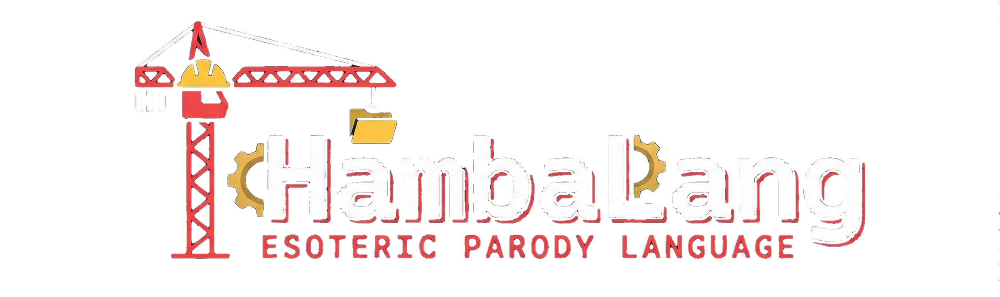

# 🏛️ HambaLang v6 — The Unification Era




> "Bahasa pemrograman satir pertama yang anggarannya bisa dikorupsi secara deterministik."

HambaLang adalah bahasa pemrograman satir tentang proyek mangkrak dan birokrasi.
Satirnya serius: ada lexer, parser, tree-walking interpreter, compiler ke
bytecode, stack VM, debugger, REPL, dan playground web — semuanya berbagi
**satu core** dan diuji agar interpreter dan VM menghasilkan output yang
identik untuk setiap program.

```hl
fungsi fib(n)
    jika n < 2
        kembalikan n
    akhir
    kembalikan fib(n - 1) + fib(n - 2)
akhir

lapor "Fibonacci: " + petakan(rentang(10), fib)

coba
    Korupsi(30)
    jika anggaran < 800000000
        Mangkrak "Dana tidak cukup untuk groundbreaking"
    akhir
jikaGagal alasan
    lapor "⚠️ " + alasan
akhirCoba

selesai()
```

---

## 🚀 Quick Start

```bash
git clone https://github.com/fk0u/HambaLang.git
cd HambaLang
pip install -e .            # core tanpa dependency; tambah [http] / [db] bila perlu

hambalang run examples/algorithms.hl          # interpreter
hambalang run examples/algorithms.hl --vm     # compile ke bytecode, jalan di HambaVM v4
hambalang repl                                # mode interaktif
```

Tanpa install: `python -m hambalang run file.hl` (atau perintah lama
`python cli/hambalang.py ...` / `python interpreter/hamba_v2.py file.hl` — masih jalan).

### Perintah CLI

| Perintah | Fungsi |
|----------|--------|
| `hambalang run FILE.hl [--vm] [--seed N] [--audit] [--fast]` | Jalankan source (interpreter atau VM) |
| `hambalang run FILE.hbc` | Jalankan bytecode (v4, atau legacy v3 otomatis terdeteksi) |
| `hambalang compile FILE.hl [-o OUT]` | Kompilasi ke bytecode HBC v4 |
| `hambalang disasm FILE.hbc` | Disassemble bytecode (v3/v4) |
| `hambalang debug FILE.hl [-b BARIS]` | Debugger: step, breakpoint, inspeksi variabel, evaluasi ekspresi |
| `hambalang check FILE...` | Verifikasi sintaks tanpa menjalankan (cocok untuk CI) |
| `hambalang repl` | REPL dengan blok multi-baris |
| `hambalang ctf FILE.hl` | Main challenge CTF (sandbox) |
| `hambalang obfuscate / analyze` | Toolchain legacy v3 (Phase 4, Hell Mode) |

Opsi runtime penting:

- `--seed N` — RNG deterministik (korupsi, event mangkrak, `acak()`).
- `--step-limit N` — batas langkah; habis = `NegaraBangkrut` (tidak bisa ditangkap `coba`).
- `--sandbox` / `--strict` — blokir file, database, dan HTTP.
- `--fast` — lewati jeda `Mangkrak(ms)`.

Error dilaporkan lengkap dengan posisi dan cuplikan source:

```
OperasiIlegal di laporan.hl:12
  Pembagian dengan nol (kayak bagi anggaran di akhir tahun)
   12 |     rata = total / jumlah_proyek
```

---

## 📖 Bahasa dalam 2 Menit

Lengkapnya di **[SYNTAX.md](SYNTAX.md)**; grammar formal di **[docs/Grammar.ebnf](docs/Grammar.ebnf)**.

| Konsep | Sintaks |
|--------|---------|
| Output | `lapor x` · `print x` |
| Variabel | `x = 1` · `set x = 1` · `Anggaran x = 1` · `x += 5` |
| Tipe | angka `42 3.14 1_000_000`, teks `"a\n"`, `benar/salah`, `kosong`, daftar `[1, 2]`, objek `{nama: "x"}` |
| Akses | `daftar[0]`, `daftar[-1]`, `obj["k"]`, `obj.k` |
| Operator | `+ - * / % **`, `== != < > <= >=`, `dan atau bukan` (short-circuit) |
| Kondisi | `jika .. ataujika .. atau .. akhir` · `jika c maka lapor "x"` |
| Loop | `selama c .. akhir` · `untuk i dari 1 sampai 10 langkah 2` · `untuk x dalam daftar` · `Rapat(3) .. selesaiRapat` |
| Fungsi | `fungsi f(a, b) .. kembalikan .. akhir` (closure, rekursi, first-class) |
| Prosedur | `prosedur P() .. akhirProsedur` (bisa menulis variabel luar) |
| Scope | `mulai .. akhir` · `global x` |
| Error | `coba .. jikaGagal e .. akhirCoba` · `Mangkrak "alasan"` |
| Input | `Tagih x` · `Tagih x, "Prompt: "` |
| Satire | `Korupsi(persen)` · `Mangkrak(ms)` · `selesai()` · `RapatInfinite()` · `Audit()` |

**Satu parser, semua dialek.** Program lama tetap valid: dialek v2
(`jika/akhir`), advanced v3 (`set`, `coba`, `Rapat(n)`), dan dialek formal v5
(`Rapat … Bubarkan`, `Sita {} Pengadilan {}`, `Proyek {}`, `BagiRata`, `Janji`,
`Wacana`) bisa dicampur dalam satu file.

**State negara.** `anggaran` (awal Rp 1 M), `progress`, `status_proyek`, dan
`total_korupsi` (read-only) selalu global.

---

## 🏗️ Arsitektur

```
source .hl ──► lexer ──► parser ──► AST ─┬──► interpreter (tree-walking) ──┐
                                         │                                 ├──► runtime bersama
                                         └──► compiler ──► HBC v4 ──► VM ──┘    (nilai, operator,
                                                              │                  scope, stdlib)
                                                              └──► .hbc file / disasm / debugger
```

| Modul | Isi |
|-------|-----|
| `hambalang/lexer.py` | Token + posisi baris/kolom, escape string, komentar `//` `#` `/* */` |
| `hambalang/parser.py` | Recursive descent + precedence climbing, semua dialek → satu AST |
| `hambalang/interpreter.py` | Engine referensi |
| `hambalang/compiler.py`, `bytecode.py`, `vm.py` | Compiler HBC v4, format file, disassembler, HambaVM v4 |
| `hambalang/runtime.py` | Nilai, operator, scope, state negara — dipakai kedua engine |
| `hambalang/builtins.py` | Standard library (60+ fungsi) |
| `hambalang/cli.py` | CLI, REPL, debugger |
| `web/` | Playground SvelteKit + Pyodide yang memuat core yang sama |
| `compiler/`, `vm/`, `obfuscator/`, `ctf/hell_mode.py` | Toolchain legacy v3 (Phase 3–4) |

Spesifikasi: [Language Spec](docs/HambaLang_Spec.md) · [VM Spec](docs/VM_Spec.md) ·
[Operational Semantics](docs/Semantics.md) · [Paper](paper/HambaLang.md)

---

## 🧪 Testing

```bash
pip install -e ".[dev]"
pytest            # 650+ test (termasuk 400 program fuzz)
ruff check hambalang tests
```

Setiap test semantik dijalankan dua kali — di interpreter dan di HambaVM v4.
Semua program di `examples/` dan `ctf/`, plus 400 program acak dari fuzzer
(`tests/test_fuzz.py`), diuji dengan *differential testing*: output, jenis
error, pesan, dan nomor barisnya harus identik di kedua engine. Bytecode semua
contoh juga harus lolos round-trip serialisasi.

---

## 🏴 CTF Pack

```bash
hambalang ctf ctf/challenge_easy.hl
```

Tiga challenge di [`ctf/`](ctf/README.md) memakai dialek formal v5.
Jalan di sandbox: akses file/DB/HTTP dimatikan.

## 🌐 Playground

```bash
cd web && npm install && npm run dev
```

Build menyalin `hambalang/` ke `static/` lalu Pyodide menjalankannya di
browser — interpreter dan VM yang sama dengan CLI, mode sandbox.

## 🐳 Docker

```bash
docker build -t hambalang .
docker run --rm hambalang                                  # demo
docker run --rm -v "$PWD:/src" hambalang run /src/x.hl
```

---

*Diverifikasi oleh Kementerian Birokrasi Digital. No. SK: 2026/HAMBALANG/V6/TERPADU*
